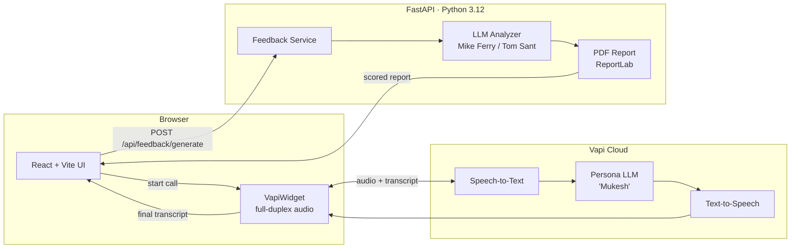

<div align="center">

# Sell The Pen AI

### Voice-first sales training that talks back.

Practice cold calls against a real-time AI prospect, get scored against the **Mike Ferry** and **Tom Sant** methodologies, and walk away with an actual playbook for the next call — not a generic LinkedIn carousel.

<br />


<br />

<!--
  📸  Drop a 10–20s screen recording (MP4 → GIF) of a live call into ./docs/demo.gif
       and the line below will render it on GitHub automatically.
-->
<!--  -->

</div>

---

## Why this exists

Sales reps don't fail because they didn't read enough books. They fail because they get one shot a day to call a real prospect, freeze halfway through the opener, and then wait 24 hours to try again.

**Sell The Pen AI** collapses that loop. You spin up a live, full-duplex conversation with an AI buyer named *Mukesh* — a deliberately tough Dubai real-estate prospect — pitch him, get rejected, recover, and the moment you hang up the platform has already scored the call against a named methodology and handed you back the exact lines that landed and the exact ones that didn't.

It's the kind of repetition that used to cost \$2,500/day at a sales bootcamp. Now it's a tab in your browser.

---

## ✨ What it does

| | |
|---|---|
| 🎙️ **Live voice cold-calls** | Sub-second turn-taking with a Vapi-hosted assistant. Real interruptions, real objections, real silence-when-you-ramble. |
| 📊 **Methodology-graded feedback** | Every transcript is scored against the Mike Ferry framework (opening, objection handling, conversation control, close) and timestamped back to the moment it happened. |
| 📄 **Proposal teardown** | Drop in a PDF proposal and get a Tom Sant *Persuasive Business Proposals* breakdown across five dimensions, with the exact paragraph rewrites suggested. |
| 🧬 **8-step onboarding** | Captures experience level, communication style, resilience and top blockers — so the AI prospect's difficulty and the feedback tone are tuned to *you*. |
| 🎯 **Smart recommendations** | A small matching layer ranks which skill to drill next based on your stated weaknesses. |
| 💾 **Local-first** | Nothing leaves your machine in dev mode. Vapi handles the audio leg; everything else runs on `localhost`. |

---

## 🧠 How it's wired



The browser owns the conversation. The backend owns the judgement. Clean separation, easy to swap any layer.

---

## 🚀 Quick start

> You'll need [Node 20+](https://nodejs.org/), [Python 3.12+](https://www.python.org/downloads/), and [`uv`](https://docs.astral.sh/uv/) installed.
> You'll also need a free [Vapi](https://vapi.ai) account and an OpenAI key.

### 1. Clone

```bash
git clone https://github.com/<your-username>/sell-pen-ai-flow.git
cd sell-pen-ai-flow
```

### 2. Frontend

```bash
npm install
cp .env.example .env        # then paste your Vapi public key + assistant ID
npm run dev                 # http://localhost:8080
```

### 3. Backend

```bash
cd backend
uv venv && source .venv/bin/activate
uv pip install .
cp .env.example .env.local  # then paste your OPENAI_API_KEY
make dev                    # http://localhost:3000
```

### 4. Offline demo (no API keys)

```bash
# In .env
VITE_DUMMY=true
VITE_TYPE=GOOD     # or BAD — loads one of two fixture transcripts
```

That short-circuits the live call and runs the entire flow against a bundled transcript — perfect for screenshots, recording demos, or showing the project at a coffee shop on hotel Wi-Fi.

---

## 🧱 Tech stack

**Frontend** — React 18 · TypeScript 5 · Vite 5 · Tailwind CSS · shadcn/ui · React Router · TanStack Query · `@vapi-ai/web`

**Backend** — FastAPI · Pydantic v2 · OpenAI Python SDK · `vapi-server-sdk` · Deepgram SDK · ReportLab · uv

**Voice / AI** — Vapi (orchestration + STT + TTS) · OpenAI GPT-4-class (analysis)

---

## 🗂 Project structure

```
sell-pen-ai-flow/
├── src/                       # React app
│   ├── components/
│   │   └── VapiWidget.tsx     # Full-duplex call widget
│   ├── pages/
│   │   ├── onboarding/        # 8-step profile wizard
│   │   ├── CallSimulation.tsx # Live "Talk to Mukesh"
│   │   ├── Feedback.tsx       # Mike Ferry scorecard
│   │   ├── ProposalCrafting.tsx
│   │   └── Recommendations.tsx
│   ├── contexts/UserProfileContext.tsx
│   └── lib/env.ts             # Typed env access
├── backend/                   # FastAPI service
│   ├── main.py
│   ├── app/
│   │   ├── routes/feedback.py
│   │   └── services/          # LLM analysis + scoring
│   └── prompts/               # Versioned system prompts
├── transcripts/               # Fixture transcripts for offline demos
├── docs/                      # Long-form architecture & flow docs
├── .env.example               # Frontend env template
├── backend/.env.example       # Backend env template
└── SECURITY.md
```

---

## 🔐 Security & secrets

This repository is public on purpose, so a quick word on what's safe and what isn't:

- **No live keys are committed.** Every secret lives in `.env` / `.env.local`, which are git-ignored and have never been pushed (verified with `git log --diff-filter=A`).
- **`VITE_VAPI_PUBLIC_KEY` is browser-public by design** — that's how Vapi's web SDK is meant to work. Lock it to your production domain(s) in the [Vapi dashboard](https://dashboard.vapi.ai/) so it can't be used from elsewhere.
- **All sensitive keys live server-side**: `OPENAI_API_KEY`, `VAPI_API_KEY` (private), `DEEPGRAM_API_KEY`, `DATABASE_URL`. They never leave the FastAPI process.
- **Reporting an issue?** See [SECURITY.md](./SECURITY.md) for the responsible-disclosure flow.

If you fork this repo, the first thing to do is rotate any keys you've used locally and double-check your own `.gitignore` before your first push.

---

## 🗺 Roadmap

- [x] Live voice cold-call flow with Vapi
- [x] Mike Ferry scoring on returned transcripts
- [x] Tom Sant proposal teardown UI (demo data)
- [x] 8-step personalisation onboarding
- [ ] Real PDF parsing + Tom Sant grading pipeline
- [ ] Multiple AI prospects (skeptical CFO, gatekeeper, FSBO seller…)
- [ ] Conversational follow-up coach on the feedback page
- [ ] Practice streaks + history dashboard
- [ ] Self-hostable Docker compose

---

## 🧪 Methodologies referenced

This project is built around two named bodies of work — both are credited because they shape the rubric, not because the project is affiliated with either:

- **Mike Ferry** — cold-calling structure: opening, objection handling, control, close.
- **Tom Sant**, *Persuasive Business Proposals* — customer-centricity, executive summary, proof points, win themes, value pricing.

---

## 👋 Author

Built by **Amir Hossein Kazemkhani** — founder of [Nova Labs](https://novalabs.ae), based in Dubai. I build voice-first AI products and ship them publicly.

If this resonates and you want to talk shop on voice agents, sales tooling, or just AI-built-in-public:

- 🔗 **LinkedIn** — [linkedin.com/in/amirkazemkhani](https://www.linkedin.com/in/amirkazemkhani/)
- 🐙 **GitHub** — [@amirhosseinkazemkhani](https://github.com/amirhosseinkazemkhani)
- 🌐 **Nova Labs** — [novalabs.ae](https://novalabs.ae)
- ✉️ **Email** — [amir@amirkazemkhani.com](mailto:amir@amirkazemkhani.com)

If you're a founder, recruiter, or fellow builder reading this — **star the repo** ⭐ so it surfaces in search, and feel free to open an issue with a question. I read every one.

---

## 📄 License

[MIT](./LICENSE) — do what you like, attribution appreciated, no warranty.

---

<div align="center">
  <sub>Built in public. Shipped from Dubai. 🇦🇪</sub>
</div>
