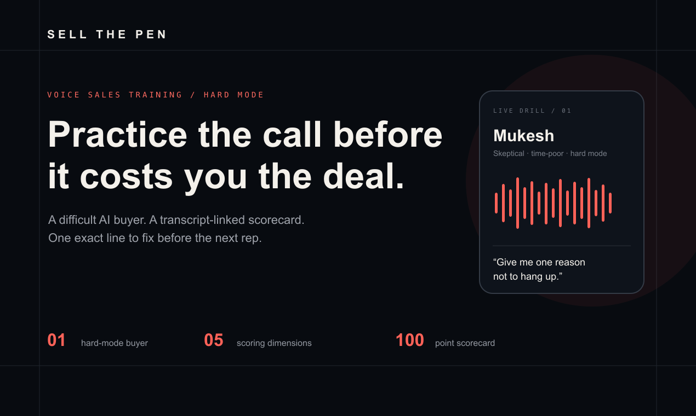
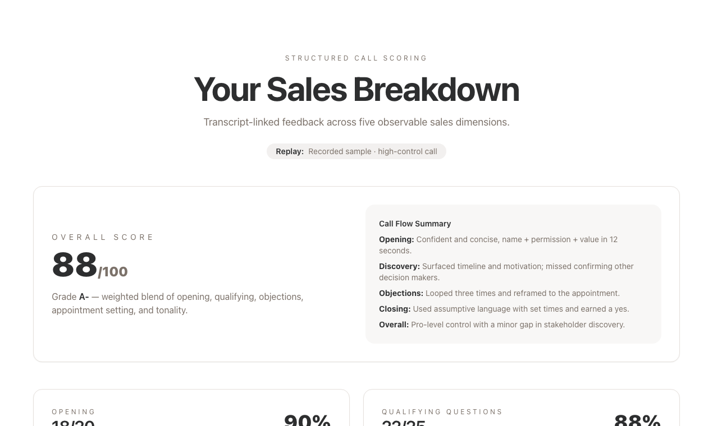
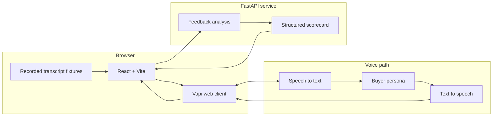

<div align="center">

# Sell The Pen AI

### Voice sales practice in hard mode.

Practice against a difficult AI buyer, then turn the transcript into a scored breakdown and one focused drill for the next rep.

[Live demo](https://sell-the-pen-ai.vercel.app/) · [Scored replay](https://sell-the-pen-ai.vercel.app/feedback?demo=GOOD) · [Launch kit](./docs/launch/PRODUCT_HUNT.md)

[](https://github.com/Kazemkhani/sell-the-pen-ai/actions/workflows/ci.yml)
[](./LICENSE)
[](https://react.dev/)
[](https://fastapi.tiangolo.com/)



</div>

## The practice loop

Most sales advice is consumed away from the moment it is needed. Sell The Pen AI compresses the loop into one session:

1. Enter a voice drill with a buyer who interrupts, objects and withholds easy answers.
2. Finish the conversation and preserve its transcript.
3. Review a transparent 100-point scorecard across five observable dimensions.
4. Repeat one exact line or drill before the next attempt.

The public deployment defaults to a deterministic recorded replay, so anyone can inspect the complete scoring experience without an account or API key. Live voice is available when a Vapi public key and assistant ID are configured.

## What is real today

| Capability | Evidence |
|---|---|
| Difficult voice buyer | One Vapi persona with interruption and objection handling |
| Structured scorecard | Opening 20, discovery 25, objections 25, appointment setting 20, delivery 10 |
| Transcript-linked coaching | Strengths, critical mistakes, better lines and the next drill point back to the call |
| Reproducible offline path | Two bundled fixtures: a high-control call and a needs-work call |
| Inspectable launch claims | No testimonials, causal performance claims or fabricated transformation metrics |



## Architecture



The browser owns the practice session. The API owns analysis. The fixture path bypasses both external providers and returns a deterministic scorecard for demos, tests and screenshots.

## Run it locally

Requirements: Node.js 20+, Python 3.12+ and [`uv`](https://docs.astral.sh/uv/).

```bash
git clone https://github.com/Kazemkhani/sell-the-pen-ai.git
cd sell-the-pen-ai
npm ci
cp .env.example .env.local
npm run dev
```

The default configuration uses the recorded high-control call. Switch the fixture with:

```dotenv
VITE_DUMMY=true
VITE_TYPE=BAD
```

To enable the voice drill:

```dotenv
VITE_DUMMY=false
VITE_VAPI_PUBLIC_KEY=your-public-key
VITE_VAPI_ASSISTANT_ID=your-assistant-id
```

Restrict the public Vapi key to your deployed origin. Do not place private provider keys in frontend variables.

Run the optional feedback API separately:

```bash
cd backend
uv sync --frozen
cp .env.example .env.local
make dev
```

## Quality gates

```bash
npm ci
npm run lint
npm run build
npm audit --omit=dev --audit-level=moderate

cd backend
uv sync --frozen
uv run python -m compileall -q .
uv run python -c "from fastapi.testclient import TestClient; from main import app; assert TestClient(app).get('/').status_code == 200"
```

The frontend currently has zero production dependency findings at moderate severity or above. The repository history was checked for common credential patterns before the public-release gate; only documented placeholders were found.

## Project map

```text
src/
  components/VapiWidget.tsx     voice-session lifecycle
  data/dummy-feedback.ts        deterministic scored replays
  lib/transcript-source.ts      transcript source resolution
  pages/CallSimulation.tsx      live drill surface
  pages/Feedback.tsx            five-dimension scorecard
backend/
  app/routes/feedback.py        analysis API
  app/services/                 structured scoring and reporting
transcripts/                    offline call fixtures
docs/launch/                    Product Hunt copy and visual assets
```

## Current boundaries

- The public replay demonstrates product behavior; it is not evidence that training causes sales improvement.
- Scores are rubric-based coaching signals, not certifications.
- The current release has one live buyer persona and two replay fixtures.
- The proposal-analysis screen remains a prototype and is not part of the Product Hunt promise.
- The project credits frameworks that informed early rubric design. No affiliation, endorsement or certification is implied.

## Contributing and security

Issues and focused pull requests are welcome. Read [CONTRIBUTING.md](./CONTRIBUTING.md) before changing the scorecard, fixtures or provider boundaries.

Do not report vulnerabilities in a public issue. Follow [SECURITY.md](./SECURITY.md) for private disclosure.

## Author

Built by [Amir Hossein Kazemkhani](https://github.com/Kazemkhani), founder of [NOVA Labs](https://novalabs.ae), in Dubai.

## License

[MIT](./LICENSE). Attribution is appreciated; no warranty is provided.
