# User Flow Diagram - Sell The Pen AI

## Complete User Journey

```mermaid
flowchart TD
    Start([User Visits Site]) --> Landing[Landing Page<br/>Value Proposition]
    Landing --> OnboardingStart{First Time<br/>User?}

    OnboardingStart -->|Yes| Step1[Step 1: Basic Info<br/>Name: Amir Kazamkhani<br/>Company: Nova Real Estate]
    OnboardingStart -->|No| Recommendations

    Step1 --> Step2[Step 2: Experience Level<br/>Beginner/Intermediate/Experienced/Veteran]
    Step2 --> Step3[Step 3: Sales Role<br/>✅ Real Estate ONLY<br/>🚧 Others: Coming Soon]
    Step3 --> Step4[Step 4: Rejection Handling<br/>4-point resilience scale]
    Step4 --> Step5[Step 5: Communication Style<br/>Analytical/Relationship/Assertive/Patient]
    Step5 --> Step6[Step 6: Top Challenges<br/>Select up to 2]
    Step6 --> Step7[Step 7: Learning Style<br/>Trial & Error/Guided/Analytical/Quick Wins]
    Step7 --> Step8[Step 8: Goals & Timeline<br/>Confidence/Quota/Top Performer/Mastery]
    Step8 --> SaveProfile[Save to localStorage]
    SaveProfile --> Recommendations

    Recommendations[Recommendations Page<br/>Hello Amir 👋<br/>Smart Skill Matching]

    Recommendations --> ChooseSkill{Choose<br/>Skill}

    %% PATH A: Lead Outreach
    ChooseSkill -->|Lead Outreach<br/>95% match| PersonaSelect[Persona Selection<br/>✅ Dominant & Aggressive Mukesh<br/>🚧 2 Coming Soon]
    PersonaSelect --> CallSim[Call Simulation Page<br/>Shows Vapi Widget]
    CallSim --> VapiCall[Click Talk to Mukesh<br/>Real-time Voice Call]
    VapiCall --> VapiConvo[Live Conversation<br/>AI responds in real-time<br/>Transcript shown]
    VapiConvo --> EndCall[User Ends Call]
    EndCall --> FeedbackA[Feedback Display<br/>Mike Ferry Analysis]
    FeedbackA --> ScoresA[4 Score Cards<br/>Opening: 85/100<br/>Control: 72/100<br/>Objection: 68/100<br/>Closing: 78/100]
    ScoresA --> NarrativeA[Detailed Narrative<br/>Mike Ferry Concepts<br/>Specific Examples]
    NarrativeA --> ActionA{What Next?}
    ActionA -->|Practice Again| PersonaSelect
    ActionA -->|Back to Dashboard| Recommendations

    %% PATH B: Proposal Crafting
    ChooseSkill -->|Proposal Crafting<br/>75% match| PropUpload[Proposal Upload Page<br/>⚠️ Demo Mode Banner]
    PropUpload --> MockUpload[Click Upload Sample PDF<br/>Mocks: Business_Proposal_Q4_2024.pdf]
    MockUpload --> ShowFile[Shows File Details<br/>Name, Size]
    ShowFile --> Analyze[Click Analyze Proposal<br/>2-second Loading State]
    Analyze --> Results[Tom Sant Analysis Results]
    Results --> ScoresB[Overall: 72/100 Grade: B-<br/>Tom Sant Framework Analysis]
    ScoresB --> Framework[4 Sant Concepts<br/>✓ Strong: Exec Summary, Proof Points<br/>⚠ Needs Work: Customer-Centric<br/>✗ Missing: Win Themes]
    Framework --> Breakdown[5 Category Scores<br/>Customer-centric: 65<br/>Exec Summary: 82<br/>Proof Points: 88<br/>Win Themes: 45<br/>Value Pricing: 58]
    Breakdown --> Recommendations2[Strengths & Recommendations<br/>Tom Sant Quotes<br/>Next Steps]
    Recommendations2 --> ActionB{What Next?}
    ActionB -->|Analyze Another| PropUpload
    ActionB -->|Back to Dashboard| Recommendations

    %% PATH C: Objection Handling (Grayed Out)
    ChooseSkill -->|Objection Handling<br/>🚧 Coming Soon| ComingSoon[Grayed Out Card<br/>Not Clickable]
    ComingSoon --> Recommendations

    style Step3 fill:#fef3c7
    style PropUpload fill:#fef3c7
    style ComingSoon fill:#e5e7eb,stroke:#9ca3af
    style VapiCall fill:#dcfce7
    style Results fill:#ddd6fe
```



## Flow Legend

| Symbol | Meaning |
|--------|---------|
| 🚧 | Coming Soon / Not Available |
| ✅ | Active / Available |
| ⚠️ | Demo Mode / Warning |
| 👋 | Personalized Greeting |

## Key Features by Page

### Onboarding (8 Steps)
- **Real Estate Only**: Other sales roles grayed out
- **localStorage**: Profile persisted for future visits
- **Smart Matching**: Calculates skill recommendations based on profile

### Recommendations Page
- **Personalized Greeting**: "Hello Amir" (first name only)
- **Match Percentages**: 95% Lead Outreach, 75% Proposal Crafting
- **Dynamic Reasoning**: "Perfect for overcoming call anxiety" based on profile

### Lead Outreach Path
- **Vapi Integration**: Real voice AI via Vapi widget
- **Mike Ferry**: Cold calling methodology framework
- **Live Transcripts**: Real-time conversation display

### Proposal Crafting Path
- **Demo Mode**: Mock upload with sample data
- **Tom Sant**: "Persuasive Business Proposals" framework
- **5 Categories**: Customer-centric, Executive Summary, Proof Points, Win Themes, Value Pricing

## Navigation

All pages post-onboarding show:
- ✅ "Hello Amir" greeting (UserGreeting component)
- ✅ Back button to /recommendations (dashboard)
- ✅ Profile data persisted in localStorage

## Routes

```
/                           → Landing Page
/onboarding/basic-info      → Step 1
/onboarding/experience      → Step 2
/onboarding/role            → Step 3
/onboarding/personality     → Step 4
/onboarding/style           → Step 5
/onboarding/challenges      → Step 6
/onboarding/learning        → Step 7
/onboarding/goals           → Step 8
/recommendations            → Dashboard
/persona-selection          → Choose AI Persona
/call-simulation            → Vapi Voice Call
/feedback                   → Mike Ferry Analysis
/proposal-crafting          → Tom Sant Analysis
```

---

*Last Updated: November 15, 2025*
