# Sell The Pen AI - Architecture Documentation

## System Overview

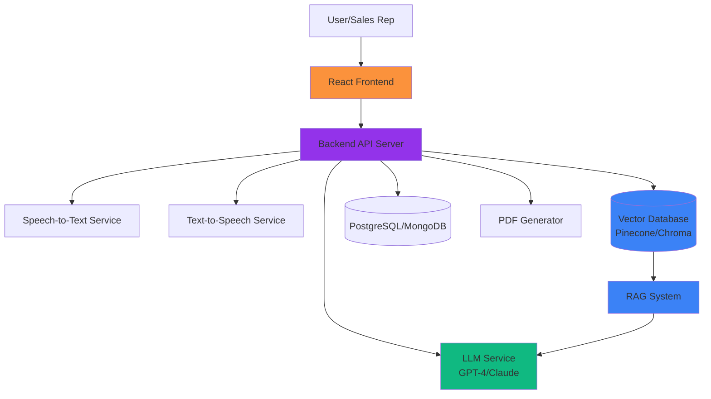

## Frontend Architecture

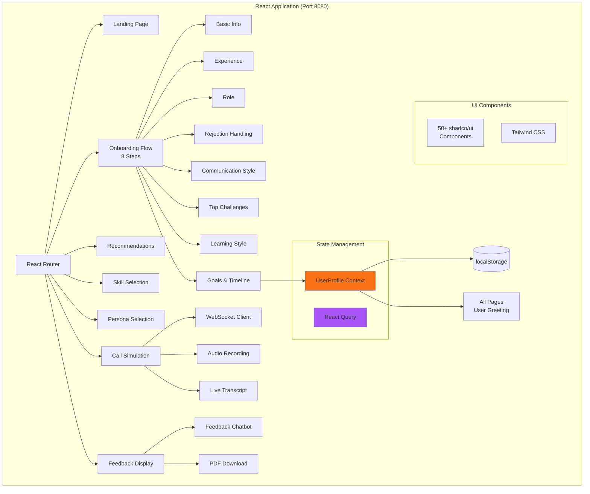

## Backend Architecture (Planned)

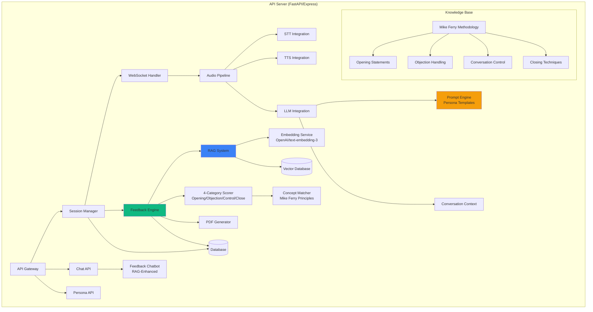

## Data Flow - Call Simulation

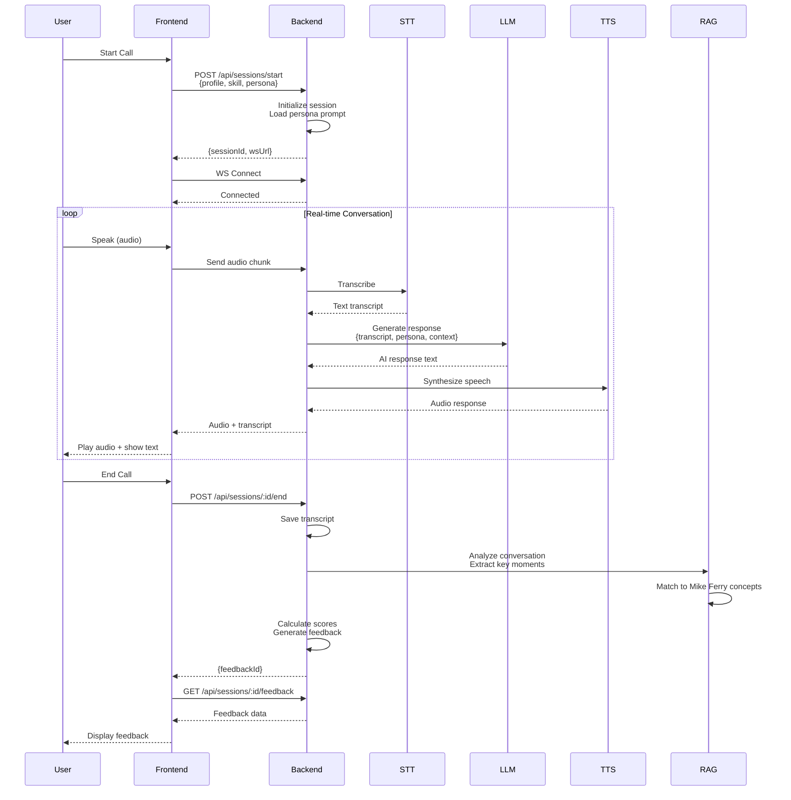

## Data Flow - Feedback Generation

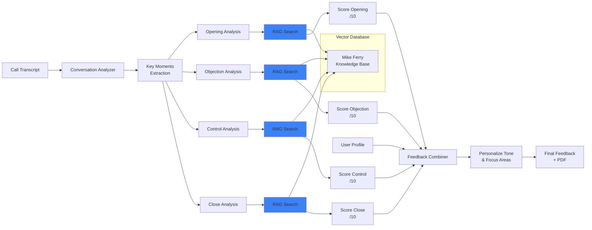

## User Journey Flow

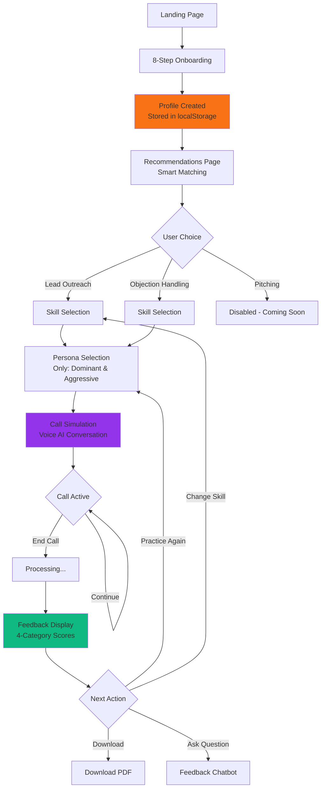

## Technology Stack Detail

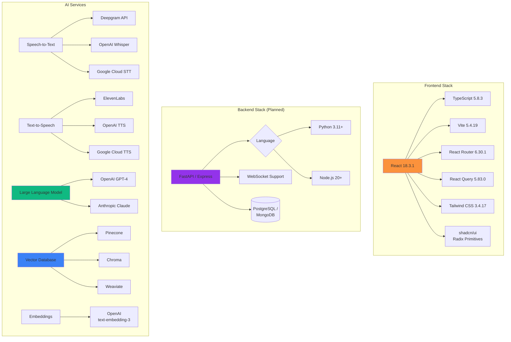

## API Endpoints

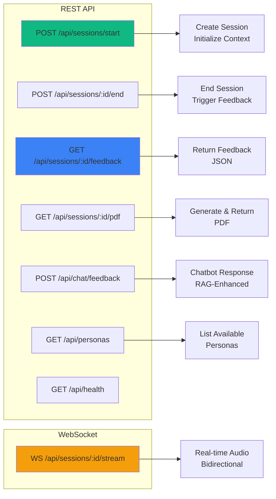

## Persona Prompt System

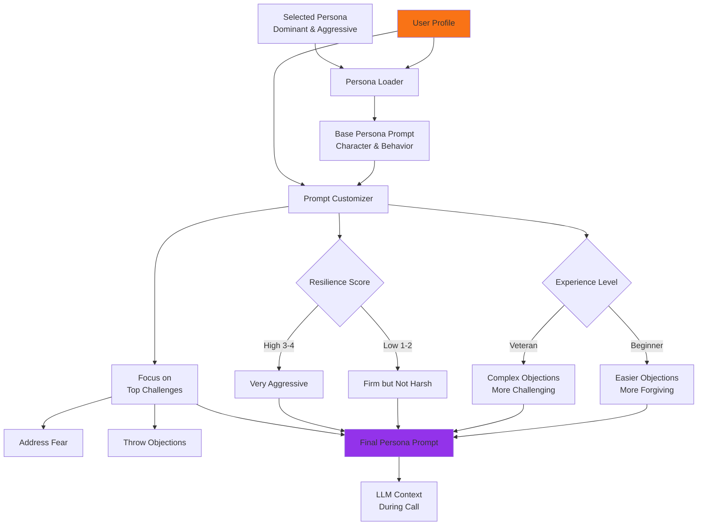

## RAG System Architecture

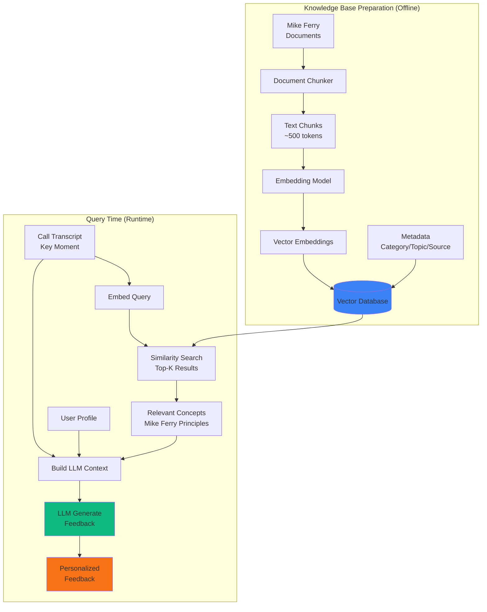

## Performance Requirements

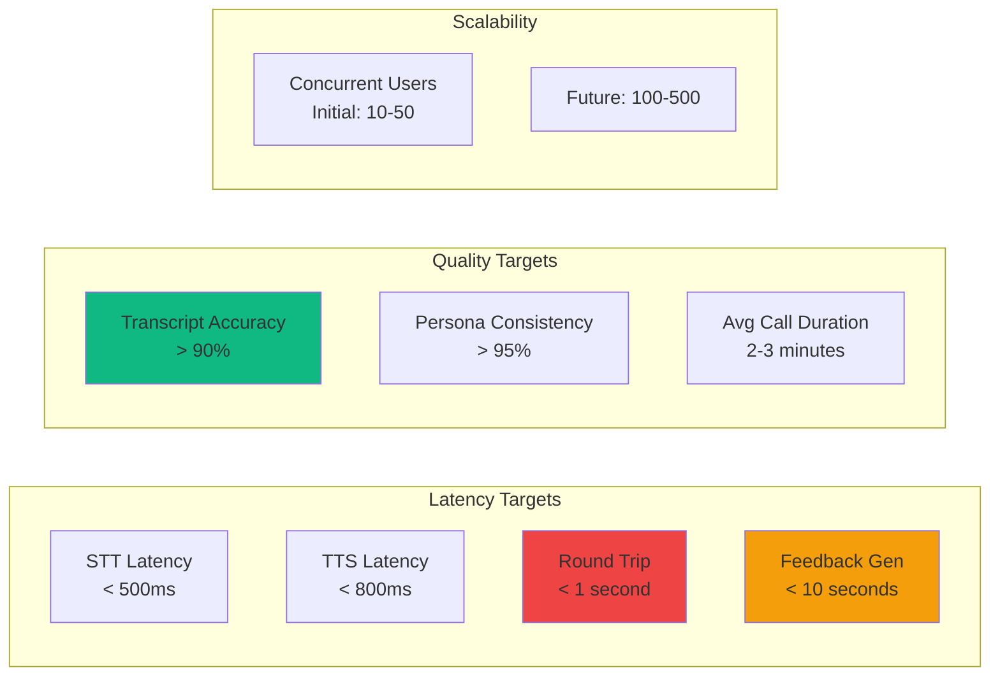

## Deployment Architecture (Future)

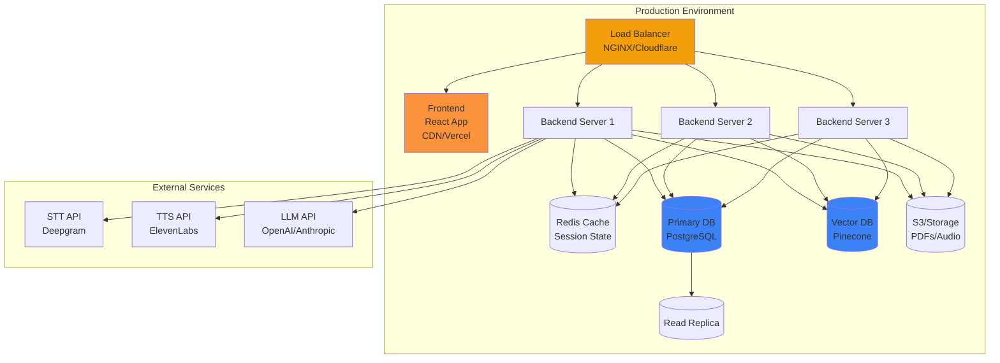

---

## Notes

- **Frontend:** Production-ready, all UI complete
- **Backend:** In development, core services planned
- **AI Integration:** STT/TTS/LLM vendors to be finalized
- **Hackathon Scope:** Single persona, basic RAG, MVP feedback
- **Post-Hackathon:** Multi-persona, auth, analytics, scaling

**Last Updated:** November 15, 2025
